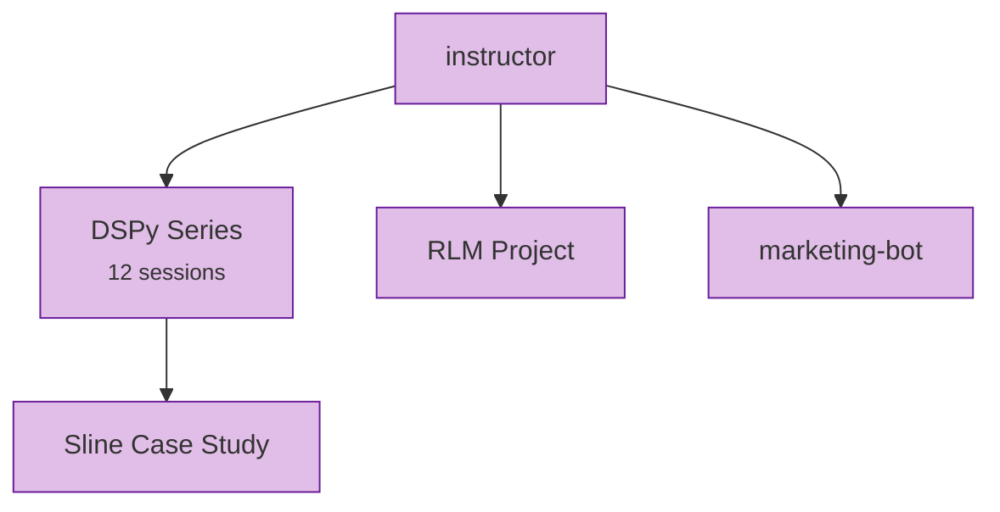

# AI / ML Path

From structured LLM outputs to a complete 12-month DSPy mastery curriculum.

**Prerequisites:** [Jinja2](../wiki/lightning-talks/jinja2.md) and [Pydantic](../wiki/lightning-talks/pydantic.md) from the [Getting Started](getting-started.md) path.

## The Sequence

1. **[Instructor](../wiki/lightning-talks/instructor.md)** :material-star::material-star::material-star: — Structured LLM outputs with Pydantic models. Uses OpenAI API + Instructor library to generate validated, typed responses from language models.
2. **[DSPy Mastery Series](../wiki/series/dspy-mastery.md)** :material-star::material-star::material-star: — 12 sessions (June 2025 – May 2026) covering the DSPy framework: LM setup, data collection, signatures, adapters, modules, metrics, optimization, assertions, and production tracking.
3. **[RLM Project](../wiki/projects/rlm.md)** :material-star::material-star::material-star: — Recursive Language Models in 77 lines. Literate programming approach where slides are the source of truth for code.
4. **[marketing-bot](../wiki/projects/marketing-bot.md)** :material-star::material-star::material-star: — Clean architecture applied to AI systems: Deming cycle (Plan-Do-Check-Adjust), dependency injection, abstract base classes, structured output.

## Where to Go Next

- DSPy Session 6 (Metrics) connects to → [Testing & Quality](testing-quality.md)
- marketing-bot architecture patterns apply broadly to any Python project
