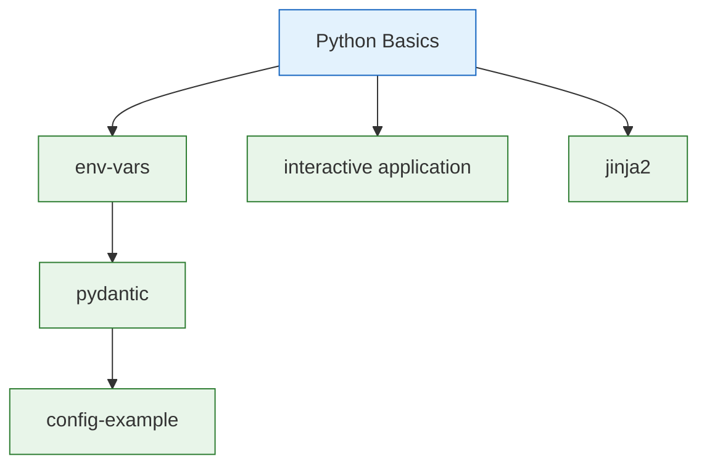

# Getting Started

New to Python or new to PySprings? This path takes you from zero to comfortable.

## The Sequence

1. **Python Basics** — If you're brand new to Python, start with [Automate the Boring Stuff](https://automatetheboringstuff.com) (Chapters 0–6) or our [Weekly Challenges](../wiki/series/weekly-challenges.md)
2. **[Environment Variables](../wiki/lightning-talks/env-vars.md)** — Learn the 12-factor app approach to configuration with `os.environ` and `python-dotenv`
3. **[Interactive Application](../wiki/lightning-talks/interactive-application.md)** — Drop into a Python REPL mid-program with `code.interact()` and IPython embedding
4. **[Jinja2](../wiki/lightning-talks/jinja2.md)** — Template rendering for configuration generation and beyond
5. **[Pydantic](../wiki/lightning-talks/pydantic.md)** — Structured configuration with type validation and environment variable binding
6. **Config Example** — A simple global configuration pattern for Python apps

## Where to Go Next

- Ready for stdlib mastery? → [Stdlib Deep Dives](stdlib-deep-dives.md)
- Interested in AI? Jinja2 leads directly to → [AI/ML Path](ai-ml.md)
- Want to secure your apps? → [Security Path](security.md)
