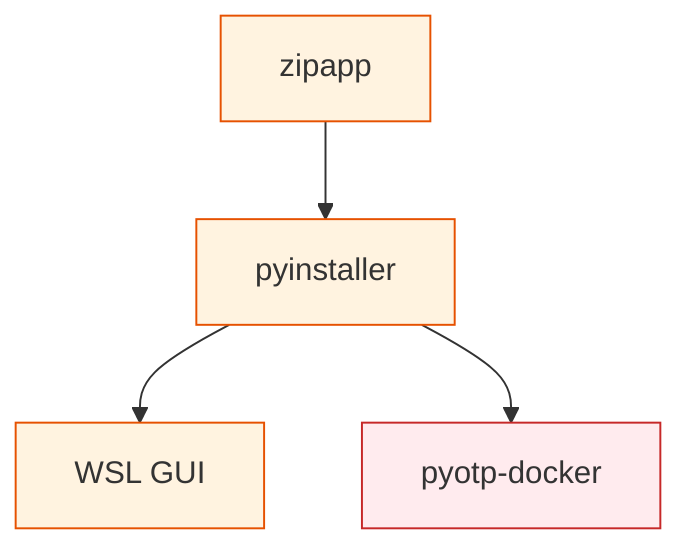

# Packaging & Distribution

Ship your Python code — as single files, executables, or containers.

## The Sequence

1. **[zipapp](../wiki/lightning-talks/zipapp.md)** :material-star::material-star: — Package a Python app as a single `.pyz` file using `zipapp`. Requires Python on the target machine.
2. **[PyInstaller](../wiki/lightning-talks/pyinstaller.md)** :material-star::material-star: — Compile Python into a standalone executable. No Python required on target. Covers `--onefile` bundles and cross-platform considerations.
3. **[WSL GUI](../wiki/lightning-talks/wsl-gui.md)** :material-star::material-star: — Run GUI applications (Tkinter, matplotlib) under Windows Subsystem for Linux with X11 forwarding.
4. **[PyOTP + Docker](../wiki/lightning-talks/pyotp-docker.md)** :material-star::material-star::material-star: — Containerize a Python application with Docker. (Also part of the [Security](security.md) path.)

## Related Content

- [Packaging Python Projects](https://packaging.python.org/tutorials/packaging-projects/) — Official PyPA tutorial
- [Poetry](https://python-poetry.org/docs/) — Modern dependency management
- [pysprings/packaging](https://github.com/pysprings/packaging) — Historical packaging talk

## Where to Go Next

- Docker knowledge from PyOTP leads into deploying → [AI/ML](ai-ml.md) projects
- Combine with → [Getting Started](getting-started.md) (env-vars, pydantic) for proper configuration in packaged apps
