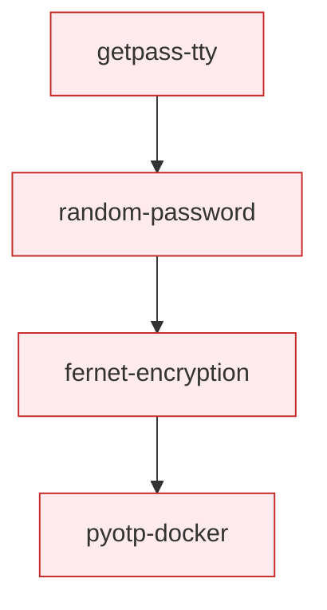

# Security Path

Secure input, password generation, encryption, and two-factor authentication.

## The Sequence

1. **[getpass & TTY](../wiki/lightning-talks/getpass-tty.md)** :material-star: — Secure password input with `getpass`, terminal detection with `isatty()`. Stdlib only.
2. **[Random Password](../wiki/lightning-talks/random-password.md)** :material-star::material-star: — Cryptographically secure random generation with `secrets`, entropy calculation, password strategies.
3. **[Fernet Database Encryption](../wiki/lightning-talks/fernet-database-encryption.md)** :material-star::material-star::material-star: — Symmetric encryption at rest with SQLAlchemy. Encrypt PII in database columns.
4. **[PyOTP + Docker](../wiki/lightning-talks/pyotp-docker.md)** :material-star::material-star::material-star: — Time-based one-time passwords (TOTP) for 2FA, packaged in a Docker container.

## Where to Go Next

- PyOTP + Docker connects to → [Packaging & Distribution](packaging-distribution.md) (containerization)
- Fernet uses SQLAlchemy — explore the [database-talk](https://github.com/pysprings/database-talk) repo for more database content
