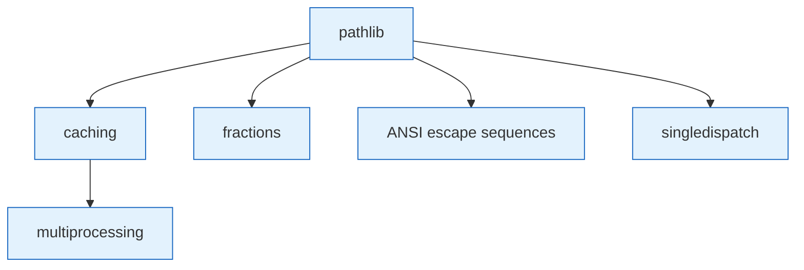

# Stdlib Deep Dives

Master the Python standard library. No external packages needed for most of these.

## The Sequence

1. **[pathlib](../wiki/lightning-talks/pathlib.md)** :material-star: — Modern, object-oriented file path handling. The foundation for everything else.
2. **[ANSI Escape Sequences](../wiki/lightning-talks/ansi-escape-sequences.md)** :material-star: — Terminal colors, positioning, and animation using only builtins
3. **[fractions](../wiki/lightning-talks/fractions.md)** :material-star: — Rational number arithmetic and measurement conversion
4. **[caching](../wiki/lightning-talks/caching.md)** :material-star::material-star: — Memoization with `functools.lru_cache` for performance
5. **[multiprocessing](../wiki/lightning-talks/multiprocess.md)** :material-star::material-star: — Parallel execution when caching isn't enough
6. **[singledispatch](../wiki/lightning-talks/singledispatch.md)** :material-star::material-star: — Function overloading based on argument type

## Where to Go Next

- pathlib feeds into → [Packaging & Distribution](packaging-distribution.md) (zipapp, pyinstaller)
- caching concepts apply to → [AI/ML Path](ai-ml.md) (DSPy optimization)
