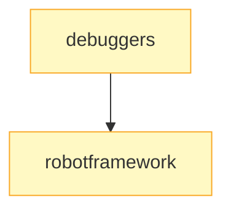

# Testing & Quality

Debugging, test automation, and quality practices.

## The Sequence

1. **[Debuggers](../wiki/lightning-talks/debuggers.md)** :material-star: — Python debugging with `breakpoint()`, pdb, ipdb, and pudb. Learn the `PYTHONBREAKPOINT` environment variable.
2. **[Robot Framework](../wiki/lightning-talks/robotframework.md)** :material-star::material-star: — Keyword-driven test automation with BDD support. Full test suite DSL.

## Related Content

- [pytest tutorial](../tutorials.md) — External tutorial on pytest fundamentals
- [Hypothesis demo](https://github.com/pysprings/hypothesis-demo) — Property-based testing (historical repo)
- [pre-commit](https://pre-commit.com/) — Automate code quality checks
- DSPy Session 6 (Metrics) and Session 9 (Assertions) in the [AI/ML path](ai-ml.md) cover quality practices for AI systems

## Where to Go Next

- Combine testing with → [Security](security.md) to test encryption code
- Apply quality practices in → [AI/ML](ai-ml.md) (DSPy metrics and assertions)
