# PySprings Tech Tree

Pick a starting point and follow the arrows. Each node links to a wiki page with code, exercises, and next steps.

Color key: :blue_square: Stdlib · :green_square: Dev Tools · :red_square: Security · :purple_square: AI/ML · :orange_square: Packaging · :yellow_square: Testing

```mermaid
graph TD
    basics["Python Basics<br/><small>week-1 & week-2</small>"]

    basics --> getpass["getpass-tty"]
    basics --> ansi["ANSI Escape<br/>Sequences"]
    basics --> pathlib["pathlib"]
    basics --> fractions["fractions"]
    basics --> caching["caching"]
    basics --> debuggers["debuggers"]
    basics --> envvars["env-vars"]
    basics --> interactive["interactive<br/>application"]
    basics --> singledispatch["singledispatch"]

    caching --> multiprocess["multiprocess"]

    envvars --> pydantic["pydantic"]
    pydantic --> configex["config-example"]

    basics --> jinja2["jinja2"]
    jinja2 --> instructor["instructor"]

    instructor --> dspy["DSPy Series<br/><small>12 sessions</small>"]
    instructor --> rlm["RLM Project"]
    instructor --> mbot["marketing-bot"]
    dspy --> sline["Sline Case Study"]

    getpass --> randpw["random-password"]
    randpw --> fernet["fernet-encryption"]
    fernet --> pyotp["pyotp-docker"]

    debuggers --> robot["robotframework"]

    pathlib --> zipapp["zipapp"]
    zipapp --> pyinstaller["pyinstaller"]
    pyinstaller --> wsl["WSL GUI"]
    pyinstaller --> pyotp

    style basics fill:#e3f2fd,stroke:#1565c0
    style getpass fill:#ffebee,stroke:#c62828
    style randpw fill:#ffebee,stroke:#c62828
    style fernet fill:#ffebee,stroke:#c62828
    style pyotp fill:#ffebee,stroke:#c62828
    style ansi fill:#e3f2fd,stroke:#1565c0
    style pathlib fill:#e3f2fd,stroke:#1565c0
    style fractions fill:#e3f2fd,stroke:#1565c0
    style caching fill:#e3f2fd,stroke:#1565c0
    style multiprocess fill:#e3f2fd,stroke:#1565c0
    style singledispatch fill:#e3f2fd,stroke:#1565c0
    style debuggers fill:#fff9c4,stroke:#f9a825
    style robot fill:#fff9c4,stroke:#f9a825
    style envvars fill:#e8f5e9,stroke:#2e7d32
    style pydantic fill:#e8f5e9,stroke:#2e7d32
    style configex fill:#e8f5e9,stroke:#2e7d32
    style interactive fill:#e8f5e9,stroke:#2e7d32
    style jinja2 fill:#e8f5e9,stroke:#2e7d32
    style instructor fill:#e1bee7,stroke:#6a1b9a
    style dspy fill:#e1bee7,stroke:#6a1b9a
    style rlm fill:#e1bee7,stroke:#6a1b9a
    style mbot fill:#e1bee7,stroke:#6a1b9a
    style sline fill:#e1bee7,stroke:#6a1b9a
    style zipapp fill:#fff3e0,stroke:#e65100
    style pyinstaller fill:#fff3e0,stroke:#e65100
    style wsl fill:#fff3e0,stroke:#e65100

    click getpass "lightning-talks/getpass-tty/"
    click ansi "lightning-talks/ansi-escape-sequences/"
    click pathlib "lightning-talks/pathlib/"
    click fractions "lightning-talks/fractions/"
    click caching "lightning-talks/caching/"
    click multiprocess "lightning-talks/multiprocess/"
    click debuggers "lightning-talks/debuggers/"
    click robot "lightning-talks/robotframework/"
    click envvars "lightning-talks/env-vars/"
    click pydantic "lightning-talks/pydantic/"
    click interactive "lightning-talks/interactive-application/"
    click jinja2 "lightning-talks/jinja2/"
    click singledispatch "lightning-talks/singledispatch/"
    click instructor "lightning-talks/instructor/"
    click randpw "lightning-talks/random-password/"
    click fernet "lightning-talks/fernet-database-encryption/"
    click pyotp "lightning-talks/pyotp-docker/"
    click zipapp "lightning-talks/zipapp/"
    click pyinstaller "lightning-talks/pyinstaller/"
    click wsl "lightning-talks/wsl-gui/"
    click dspy "series/dspy-mastery/"
    click rlm "projects/rlm/"
    click mbot "projects/marketing-bot/"
```

## Browse by Section

- **[Lightning Talks](lightning-talks/index.md)** — 20 standalone topics from group presentations
- **[Series](series/index.md)** — Multi-session deep dives (DSPy Mastery, Weekly Challenges)
- **[Projects](projects/index.md)** — Group projects and all 42 GitHub repos

## Browse by Skill Path

- **[Getting Started](../paths/getting-started.md)** — New to Python? Start here.
- **[Stdlib Deep Dives](../paths/stdlib-deep-dives.md)** — Master the standard library
- **[AI/ML](../paths/ai-ml.md)** — From structured outputs to full DSPy mastery
- **[Security](../paths/security.md)** — Passwords, encryption, and 2FA
- **[Testing & Quality](../paths/testing-quality.md)** — Debuggers, test frameworks, and metrics
- **[Packaging & Distribution](../paths/packaging-distribution.md)** — Ship your code
